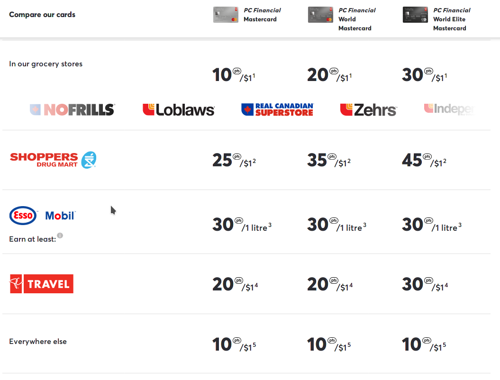

You can find a lot of Credit Cards with different Rewards Programs. Basically we have two rewards category: cash-based cards and point-based cards.

===

## Cash-Based Rewards

You can find a lot of Credit Cards in this category. When a card for example is 2% cash-back, it means for every $100.00 that you spent, the card issuer gives you $2.00. In other words:

$$
\begin{align*}
\frac {\text{gain}} {\text{spend}} &= \frac {\$2.00} {\$100.00} \\
\Rightarrow \text{gain} &= \frac {\$2.00} {\$100.00} \times \text{spend} \\
&= \$0.02 \times \text{spend}
\end{align*}
$$

As you can see there is no complication here. A more mathematically accurate calculation is as follow:

$$
\begin{align*}
\$100 \text{ spend} &= \$2 \text{ gain} \\
\Rightarrow \$1 \text{ spend} &= \$0.02 \text{ gain} \\
\Rightarrow \$1 \text{ spend} &= \$2\% \text{ gain}
\end{align*}
$$

So spending $1 earn us 2 cents. As another example spending $200 earns us $4:

$$
\begin{align*}
\$1 \text{ spend} &= \$0.02 \text{ gain} \\
\Rightarrow \$1 \times 200 \text{ spend} &= \$0.02 \times 200 \text{ gain} \\
\Rightarrow \$200 \text{ spend} &= \$4 \text{ gain}
\end{align*}
$$

## Point-Based Rewards

For me points are a type of currency that you can only spend in some specific places. Because of that some people, including me, prefer to have cash-back cards. After all you can spend dollars everywhere. Sometimes understanding the value of points is tricky and needs calculation. For example see [President’s Choice Financial Credit Cards](https://www.pcfinancial.ca/en/credit-cards):

Fortunately PC mentioned on the website that `10,000 points = $10`. So it's easy to find the worth of 1 point:

$$
\begin{align*}
10000 \text{ points} &= \$10 \text{ gain} \\
\Rightarrow 1 \text{ points} &= \$0.001 \text{ gain}
\end{align*}
$$

Let's assume for a specific category (e.g. [SHOPPERS DRUG MART](https://www1.shoppersdrugmart.ca/en/home)) the card gives us `p` points per $1 that we spent:

$$
\begin{align*}
\$1 \text{ spend} &= p \text{ points} \\
\Rightarrow \$1 \text{ spend} &= \$0.001 \times p \text{ gain} \\
\Rightarrow \$1 \text{ spend} &= \$\frac{p}{1000} \text{ gain} \\
\Rightarrow \$1 \text{ spend} &= \$\frac{p}{10}\% \text{ gain}
\end{align*}
$$

So we need to divide the points by 10 to convert it cash-back percentage. If you couldn't get the premuim ones and ended with [PC Financial Mastercard](https://www.pcfinancial.ca/en/credit-cards/pc-mastercard), then it means 2.5% cash-back in pharmacy, 2% in travel and 1% in grocery and everything besides gas. Of course you are limited to Loblaw's [divisions](http://www.loblaw.ca/en.html).

As you can see the gas points is per litre and not per dollar. [This is where the fun begins!](https://www.imdb.com/title/tt0121766/quotes?item=qt0333039) Each [Esso](https://www.esso.ca/en-ca) station has different price per litre. So we cannot convert gas points to cash-back without considering the price in a specific station. According to [GasBuddy](https://www.gasbuddy.com/), the price of gas in Esso station in downtown is 101.9 cents but Costco sells it at 93.5 cents. Let's assume we have another cash-back card with 2% cash-back for gas. The net gas price per litre for Costco is \(93.5 \times (1 - 2\%) = 91.63\) cents and for Esso is \(101.9 - 30 \text{ points} = 101.9 - 3 = 98.9\). So Costco is cheaper. As you can see point-based credit cards require a lot of calculation!

Anyway this is a good Credit Card; considering that for pharmacy you get 2.5% and at least 1% cash-back for the rest without paying annual fees. You can combine it with [Tangerine Credit Card](https://www.tangerine.ca/en/products/spending/creditcard/) to have the best of both worlds.
