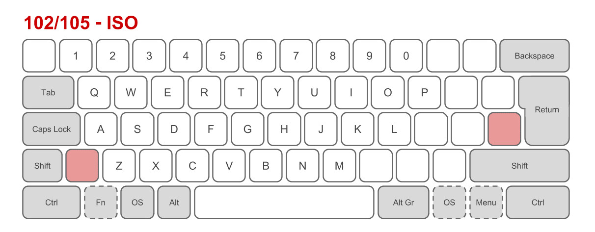
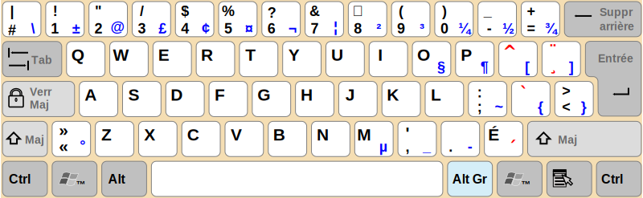
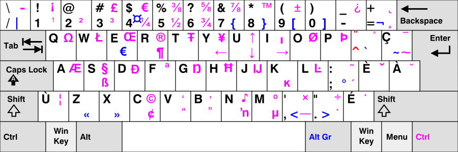
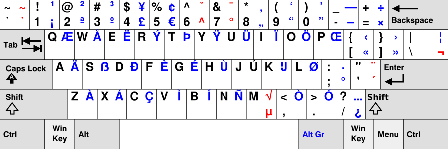

Most keyboards send [scancodes](https://en.wikipedia.org/wiki/Scancode) when we press a key. It contains the row and column of the key. It's the responsibility of the Operating System to convert it to a character. This mapping is done by [keyboard layout](https://en.wikipedia.org/wiki/Keyboard_layout).

===

# Layout categories

According to [Wikipedia](https://en.wikipedia.org/wiki/Keyboard_layout#Physical,_visual,_and_functional_layouts) we can have three category of layouts.

## Physical layout

This is the actual keys on your keyboard. If you know [touch typing](https://en.wikipedia.org/wiki/Touch_typing), this is the most important layout that you need to know.

The most important ones are ANSI and ISO. The former is common in North America and the latter in Europe.

It's possible we have more than two keyboards with ANSI layout but different labels.

## Visual layout

It's the labels that are on the keys. This is the most useless layout, specially if you are a touch typist. It's possible there is a mismatch between this and functional layout that leads to confusion because the typed letter is not the expected one.

## Functional Layout

This is the most important category and I'm going to talk about it in more details. You can change it in the Operating System. When you choose for example English layout, then Operating system knows how to convert scancodes to English letters.

# Canadian French

Unlike France and Belgium that are using [AZERTY](https://en.wikipedia.org/wiki/AZERTY), Canadian French is based on [QWERTY](https://en.wikipedia.org/wiki/QWERTY). So it's more programming-friendly.

In Linux by default a simplified French layout is used that surprisingly missing some French characters! For example œ, æ and ë. If you're a programmer, it's likely you are used to US keyboards. So you may have difficulty to type characters like `#`, `{`, `}` and so on which are common in programming languages.

There are two key modifiers to type French characters:

* [dead keys](https://en.wikipedia.org/wiki/Keyboard_layout#Dead_keys): When you press a dead key nothing happens but it changes the behavior of the next key. For example in Simplified French layout above, the key right to key `P` is a dead key. If we press it nothing happens but if we press `a` after it, we will type `à`. We can type the actual dead key by pressing `space` after it
* [Alt GR](https://en.wikipedia.org/wiki/AltGr_key): In US keyboards it's usually the right `Alt` key. For example to type `@` in simplified French layout, we should type `Alt GR + 2`

A more recent French Layout is [CSA keyboard](https://en.wikipedia.org/wiki/CSA_keyboard) which seems a bit [complicated](http://www.farah.cl/Keyboardery/A-Visual-Comparison-of-Different-National-Layouts/#enCAmu). This is the default keyboard in Windows 10. It has another modifier key (right Control in Windows) to type some characters (e.g. `Æ`).

Surprisingly in Linux this layout is separated into two layouts:

| Layout (variant) | Description |
| ---------------  | ----------- |
| ca(multi)        | Canadian (intl., 1st part) |
| ca(multi-2gr)    | Canadian (intl., 2nd part) |

For more information type `man xkeyboard-config`.

## A programming-friendly layout for French

If you prefer a US layout that let you type most European characters, including French, you can use [EurKEY](https://en.wikipedia.org/wiki/EurKEY). You can use it out-of-the-box in Linux but you need to install it in Windows or MacOS. It uses a US layout as a base and supports almost all European characters. For more information visit its official [webpage](https://eurkey.steffen.bruentjen.eu/start.html).

# Persian Layout

Linux and MacOS supports All Persian characters out-of-the-box. For Windows you need to install an application. For more information read this Persian [article](https://fa.wikipedia.org/wiki/%D9%88%DB%8C%DA%A9%DB%8C%E2%80%8C%D9%BE%D8%AF%DB%8C%D8%A7:%D8%B5%D9%81%D8%AD%D9%87%E2%80%8C%DA%A9%D9%84%DB%8C%D8%AF_%D9%81%D8%A7%D8%B1%D8%B3%DB%8C).
