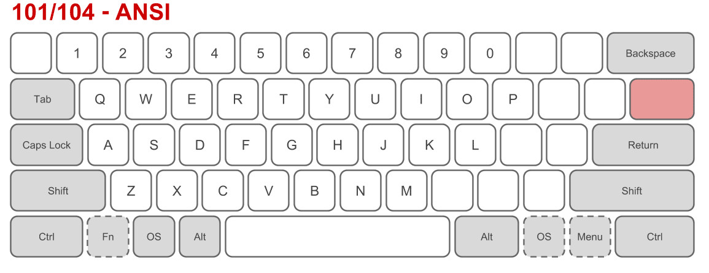

Most keyboards send [scancodes](https://en.wikipedia.org/wiki/Scancode) when a keys are pressed which contain the row and column of the key. It's the responsibility of the Operating System to convert them into characters. This mapping is done by [keyboard layouts](https://en.wikipedia.org/wiki/Keyboard_layout).

===

# Layout categories

According to [Wikipedia](https://en.wikipedia.org/wiki/Keyboard_layout#Physical,_visual,_and_functional_layouts) we can have three category of layouts.

## Physical layout

This is the actual keys on your keyboard. If you know [touch typing](https://en.wikipedia.org/wiki/Touch_typing), this is the most important layout that you need to know.

The most important ones are ANSI and ISO. The former is common in North America and the latter in Europe.

## Visual layout

Labels on the keys creating this layout. If you are a touch typist, usually you don't care a lot about this layout. You can even buy blank keyboards that don't have any labels. Sometimes there are mismatches between keyboard labels and the actual characters that are shown on the screen.

## Functional Layout

This is the most important category that is responsible for converting scancodes to actual characters. You can change it in the Operating System. When you choose for example English layout, then Operating system knows how to convert scancodes to English letters. Although your keyboard has English labels, you can type in other languages by changing functional layout.

# Canadian French

Unlike France and Belgium that are using [AZERTY](https://en.wikipedia.org/wiki/AZERTY), Canadian French is based on [QWERTY](https://en.wikipedia.org/wiki/QWERTY).

In Linux by default a simplified French layout is used that surprisingly missing some French characters! For example œ, æ and ë. If you're a programmer, it's likely you are used to US keyboards. So you may have difficulty to type characters like `#`, `{`, `}` which are common in programming languages.

There are two key modifiers to type French characters:

* [dead keys](https://en.wikipedia.org/wiki/Keyboard_layout#Dead_keys): When you press a dead key nothing happens but it changes the behavior of the next key. For example in Simplified French layout above, the key right to key `P` is a dead key. If we press it nothing happens but if we press `a` after it, the character `â` is shown on the screen. We can type the actual dead key (`^`) by pressing `space` key after it
* [Alt GR](https://en.wikipedia.org/wiki/AltGr_key): In US keyboards it's usually the right `Alt` key. For example to type `@` in simplified French layout, we should type `Alt GR + 2`

A more recent French Layout is [CSA keyboard](https://en.wikipedia.org/wiki/CSA_keyboard) which seems a bit [complicated](http://www.farah.cl/Keyboardery/A-Visual-Comparison-of-Different-National-Layouts/#enCAmu). This is the default keyboard in Windows 10. It has another modifier key (right Control in Windows) to type some characters (e.g. `Æ`).

Surprisingly in Linux this layout is separated into two layouts:

| Layout (variant) | Description |
| ---------------  | ----------- |
| ca(multi)        | Canadian (intl., 1st part) |
| ca(multi-2gr)    | Canadian (intl., 2nd part) |

For more information type `man xkeyboard-config`.

## A programming-friendly layout for European languages

[EurKEY](https://en.wikipedia.org/wiki/EurKEY) is based on US layout as well as almost all European characters. You can use it out-of-the-box in Linux but you need to install it in Windows or MacOS. For more information visit its official [webpage](https://eurkey.steffen.bruentjen.eu/start.html).

# Persian Layout

Linux and MacOS supports All Persian characters out-of-the-box. For Windows you need to install an application. For more information read this Persian [article](https://fa.wikipedia.org/wiki/%D9%88%DB%8C%DA%A9%DB%8C%E2%80%8C%D9%BE%D8%AF%DB%8C%D8%A7:%D8%B5%D9%81%D8%AD%D9%87%E2%80%8C%DA%A9%D9%84%DB%8C%D8%AF_%D9%81%D8%A7%D8%B1%D8%B3%DB%8C).
