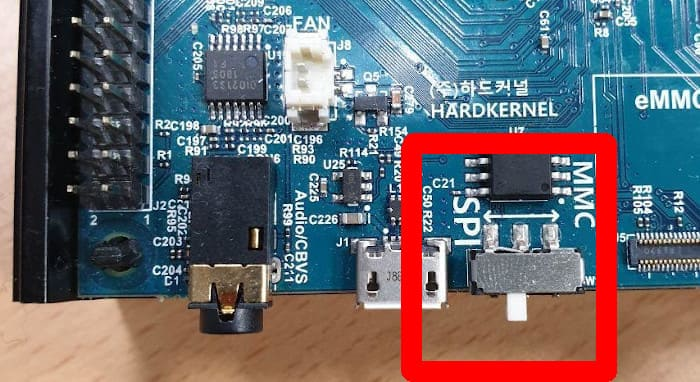

There are a lot of [single-board computers](https://en.wikipedia.org/wiki/Single-board_computer) in the market; the most famous ones are [Raspberry Pi](https://en.wikipedia.org/wiki/Raspberry_Pi) series. There are more powerful alternatives like [Odroid N2+](https://www.hardkernel.com/shop/odroid-n2-with-4gbyte-ram-2/) that I'm going to explain how to prepare two Operating Systems for it. I mainly focus on partitioning the storage unit using `parted` command line. You can use `GParted` which is a front-end for it.

===

[Odroid series](https://en.wikipedia.org/wiki/ODROID) are developed by South Korean company named [HardKernel](https://www.hardkernel.com/). Odroid N2+ price is close to Raspberry Pi 4 but it's more powerful. You can watch 4K HDR movies smoothly. It's based on [Amlogic S922X](https://en.wikipedia.org/wiki/Amlogic#Media_player_SoCs_(S9_family_gen_2)) [SoC (System on a chip)](https://en.wikipedia.org/wiki/System_on_a_chip) that contains Quad-core Cortex-A73 and Dual-core Cortex-A53 CPUs and Mali-G52 GPU. Fore more information about specification you can refer to this [page](https://www.hardkernel.com/shop/odroid-n2-with-4gbyte-ram-2/).

You can use it as a media center by installing [Kodi](https://en.wikipedia.org/wiki/Kodi_(software)) or your personal [NAS](https://en.wikipedia.org/wiki/Network-attached_storage) or your personal server. Since it doesn't require a fan for cooling it's very quiet.

## How to Purchase Odroid N2

You can directly order it through HardKernel [website](https://www.hardkernel.com/). If you don't live in South Korea, it's better to order it from one of the [official distributors](https://www.hardkernel.com/distributors/). I recommend you also purchase an [eMMC](https://en.wikipedia.org/wiki/MultiMediaCard#eMMC) storage instead of a slower storage like MicroSD. I should mention you must purchase case, power cable and other components separately.

You don't need to purchase eMMC reader. We can use N2 device to write OS image into it. You can follow the instructions on this [link](https://magazine.odroid.com/article/emmc-memory-modules-a-simple-guide/) to install eMMC module. Please ignore other suggestions like buying eMMC reader.

## Dual Booting

As you can see Odroid N2+ is a recommended device for playing 4K HDR movies in Kodi's [forum](https://forum.kodi.tv/showthread.php?tid=332180). We are going to install two operating systems on N2:

1. [CoreELEC](https://coreelec.org/): a "Just enough OS" Linux distribution based on Kodi. I should mention CoreELEC focused on Amlogic hardware like N2. If you want to have Kodi on Raspberry Pi you should try [LibreELEC](https://libreelec.tv/)
2. [Ubuntu](https://wiki.odroid.com/getting_started/os_installation_guide#operating_systems_we_re_providing): Unlike CoreELEC, it's a full GNU/Linux so you can customize it more than CoreELEC

I also tried Android. The problem was the absence of Netflix on Google Play Store. It seems it is supported on a special type of Android. If you are interested in Netflix on Android, you can follow this [tutorial](https://magazine.odroid.com/article/android-tv-odroid-c2-amazon-prime-video-netflix/). I don't think it supports 4K videos. Another option is to install Netflix addon on CoreELEC.

!! **Warning:** <em>Please understand that the following commands can erase your data. You shouldn't copy them without understanding them. It's likely that you need to modify them. I assumed you're comfortable with Linux.</em>

## Installing CoreELEC

I was inspired by this [post](https://forum.odroid.com/viewtopic.php?p=316727). My method here is a bit different and we have more control over partitioning.

First we need to put N2 on SPI mode (the image is copied from Odroid Wiki):



The boot sequence between MMC and SPI is different; for more information you can read this wiki [page](https://wiki.odroid.com/odroid-n2/software/boot_sequence).

Since we don't have eMMC reader, we should follow this [tutorial](https://wiki.odroid.com/getting_started/petitboot/os_installation_using_otg) so we can see eMMC as a USB Mass Storage. It's very important when you are in Petitboot, you select "exit to shell", then run the following command to update it:

```sh
# pb-update
```

You may need to restart it. Please follow the [tutorial](https://wiki.odroid.com/getting_started/petitboot/os_installation_using_otg) but don't flash the OS image. After running `ums /dev/mmcblk0` command in Petitboot, you should see it as a USB storage. Let's assume it's `/dev/sda`. It's likely it's different for you. So please confirm it. I assumed you are running a Linux OS. If you don't, this is not the tutorial you're looking for!

First we are going to install CoreELEC. You can find the image from this [link](https://wiki.odroid.com/odroid-n2/os_images/third_party). We are going to Flash eMMC using [dd](https://en.wikipedia.org/wiki/Dd_%28Unix%29) command. As I mentioned before, running it can destroy your data. So first confirm that you are using the correct destination device. For more information about `dd` command, you can read this wiki [page](https://wiki.archlinux.org/title/Dd).

```sh
$ sudo dd if=CoreELEC-Amlogic-ng.arm-19.3-Matrix-Odroid_N2.img of=/dev/sda bs=1M status=progress
```

After running this command, we should have two partitions. We can confirm it by:

```sh
$ sudo parted /dev/sda unit MiB print

Model: Linux File-Stor Gadget (scsi)
Disk /dev/sda: 29820MiB
Sector size (logical/physical): 512B/512B
Partition Table: msdos
Disk Flags: 

Number  Start    End     Size     Type     File system  Flags
 1      4.00MiB  516MiB  512MiB   primary  fat16        boot, lba
 2      516MiB   548MiB  32.0MiB  primary  ext4
```

As you can see partition table is MBR (i.e. msdos). So we cannot have more than 4 primary partitions. We can have 3 primary partitions and one extended partition in which we can define many logical partitions. For more information about partition tables refer to this [link](https://wiki.archlinux.org/title/Partitioning).

Note that for installing Ubuntu we cannot follow the same approach as we did for CoreELEC. Because Ubuntu image like CoreELEC has the same structure:

```sh
+--+---------------+----------------+
|PT|  Partition 1  |  Partition 2   |
+--+---------------+----------------+
0 start                           end
```

Each disk should have one partition table and it occupies the first sectors. When copying Ubuntu image, we want to copy everything besides the first sectors that contain partition table. We want to have something like this:

```sh
+--+---------------+----------------+---------------+---------------+
|PT|  Partition 1  |  Partition 2   |  Partition 3  |  Partition 4  |
+--+---------------+----------------+---------------+---------------+
0 start                                                           end
```

We created `PT`, `Partition 1` and `Partition 2` by copying CoreELEC image using `dd` command. Now we want to have two more partitions for Ubuntu image. Since in future we may install other OSs, Instead of primary partitions, we are going to create a logical one. Before doing that, restart the device manually or by using the following command:

```sh
# reboot -f
```

CoreELEC try to resize `Partition 2` to take the entire disk. We deal with it later.

### Shrinking the Second Partition

As I mentioned before CoreELEC took the entire disk. We need to shrink partition 2. The entire size of my eMMC is 29820 MiB. Note that I'm using [binary units](https://en.wikipedia.org/wiki/Binary_prefix). So `1KB = 1024B`. I prefer it because `parted` will not modify the locations. For more information read the official [manual](https://www.gnu.org/software/parted/manual/html_node/Running-Parted.html). Note taht the default units for `parted` are `KB`, `MB` and so on. In other words `1KB = 1000B`.

I want to allocate 26% of eMMC to partition 2. I'm using bc for calculation. If you are not familiar with it you can read about it [here](https://en.wikipedia.org/wiki/Bc_(programming_language)).

```sh
echo "0.26 * 29820 / 1024" | bc -l
7.57148437500000000000
```
So the size of second partition should be around 7.57GB.

! File system size shouldn't exceed the partition. So if we want to expand partition, first we resize the partition and then the file system. When we are shrinking, first we resize the file system and then the partition

So we play safe and resize the file system to 7GB:


```sh
$ sudo resize2fs /dev/sda2 7G
resize2fs 1.45.6 (20-Mar-2020)
Resizing the filesystem on /dev/sda2 to 7340032 (1k) blocks.
The filesystem on /dev/sda2 is now 7340032 (1k) blocks long.
```

Now we are going to shrink the second partition so it takes 26% of eMMC:

```sh
sudo parted /dev/sda resizepart 2 26%
```
We asked parted to resize the second partition to 26% of eMMC. For performance reason, it's always a good idea the partitions are aligned. Usually parted warn us if we want to do an operation which is not aligned. We can confirm the alignment of second partition by:

```sh
sudo parted /dev/sda align-check optimal 2
2 aligned
```

Now we can expand the file system to the entire partition by not specifying the size:

```sh
resize2fs /dev/sda2
resize2fs 1.45.6 (20-Mar-2020)
Resizing the filesystem on /dev/sda2 to 7410892 (1k) blocks.
The filesystem on /dev/sda2 is now 7410892 (1k) blocks long.
```

Now we are good to install Ubuntu.

## Installing Ubuntu

### Creating Partitions

We are using a [loop device](https://en.wikipedia.org/wiki/Loop_device) to mount Ubuntu image file:

```sh
$ sudo udisksctl loop-setup -r -f ubuntu-20.04-4.9-mate-odroid-n2-20210830.img
Mapped file ubuntu-20.04-4.9-mate-odroid-n2-20210830.img as /dev/loop11.
```
As you can see for me it's mounted as `/dev/loop11`. Let's look at it:

```sh
$ sudo parted /dev/loop11 unit MiB print
Model: Loopback device (loopback)
Disk /dev/loop11: 7136MiB
Sector size (logical/physical): 512B/512B
Partition Table: msdos
Disk Flags: 

Number  Start    End      Size     Type     File system  Flags
 1      1.00MiB  129MiB   128MiB   primary  fat16        lba
 2      129MiB   7136MiB  7007MiB  primary  ext4

```

So we need to have two partitions for Ubuntu: one with the size of 128MiB and the other 7007MiB. Since we need to deal with alignment, we are using sector as a unit. A [disk sector](https://en.wikipedia.org/wiki/Disk_sector) is the minimum storage unit of hard drive. As a reminder I copied the following image from [Wikipedia](https://en.wikipedia.org/wiki/Disk_sector) that shows a disk sector (C):


`loop11` partitions with sector as our unit:

```sh
$ sudo parted /dev/loop11 unit s print
Model: Loopback device (loopback)
Disk /dev/loop11: 14614528s
Sector size (logical/physical): 512B/512B
Partition Table: msdos
Disk Flags: 

Number  Start    End        Size       Type     File system  Flags
 1      2048s    264191s    262144s    primary  fat16        lba
 2      264192s  14614527s  14350336s  primary  ext4

```

As you can see here `1 sector = 512B` in my eMMC module. Let's convert the size of first partition of loop device from sector to MiB:

```sh
$ echo "(262144 * 512) / 2^20" | bc -l
128.00000000000000000000
```
as expected it's equivalent to 128MiB. So let's create our partitions in interactive mode. As I mentioned before first we create an extended partition in which we create two logical partitions for Ubuntu. Before that first take a look at our eMMC's partitions in sector:

```sh
sudo parted /dev/sda unit s print
Model: Linux File-Stor Gadget (scsi)
Disk /dev/sda: 61071360s
Sector size (logical/physical): 512B/512B
Partition Table: msdos
Disk Flags: 

Number  Start      End        Size       Type      File system  Flags
 1      8192s      1056767s   1048576s   primary   fat16        boot, lba
 2      1056768s   15878553s  14821786s  primary   ext4
```

So let's try to create an extended partition on sector `15878554` (one sector after the partition 2):

```sh
$ sudo parted /dev/sda
(parted) unit s
(parted) mkpart extended 15878554s 100%
Warning: The resulting partition is not properly aligned for best performance: 15878554s % 2048s != 0s
Ignore/Cancel?
```
As you can see parted expected that every partition starts with a sector that is multiple of `2048s` (`1MiB`). Partition alignment is important for [SSD drives](https://en.wikipedia.org/wiki/Solid-state_drive) to avoid excessive [read-modify-write](https://en.wikipedia.org/wiki/Read%E2%80%93modify%E2%80%93write) cycles which leads to longer lifespan. Basically 1MiB alignment covers all common SSD page and block size scenarios because it's divisible by all commonly used sizes: 1MiB, 512KiB, 128KB, 4KiB and 512B. For more information read this section of [SSD drivers](https://en.wikipedia.org/wiki/Solid-state_drive#Partition_alignment) and [partition alignment](https://en.wikipedia.org/wiki/Partition_alignment).

Let's find a suitable one:

```sh
echo "15878554 % 2048" | bc
410
echo "15878554 - 410 + 2048" | bc
15880192
```

So we need to use sector `15880192`, instead of `15878554`. Now the partitions are look like this. Note that the extend partition starts from sector `15880192` to the last sector of the disk which is `61071359`.

```sh
Number  Start      End        Size       Type      File system  Flags
 1      8192s      1056767s   1048576s   primary   fat16        boot, lba
 2      1056768s   15878553s  14821786s  primary   ext4
 3      15880192s  61071359s  45191168s  extended               lba
```

Now we need to create the first partition for Ubuntu. It should start from:

```sh
$ echo "15880192 + 2048" | bc
15882240
```
We have the starting sector and we know the size of partition should be `262144s`. We use the following formula to calculate the end sector:

!!!! end = start + size - 1

So we have:

```sh
$ echo "15882240 + 262144 - 1" | bc
16144383
```
The first partition for Ubuntu:

```sh
(parted) mkpart logical fat16 15882240s 16144383s
```

The partitions look like this:

```sh
Number  Start      End        Size       Type      File system  Flags
 1      8192s      1056767s   1048576s   primary   fat16        boot, lba
 2      1056768s   15878553s  14821786s  primary   ext4
 3      15880192s  61071359s  45191168s  extended               lba
 5      15882240s  16144383s  262144s    logical                lba
```
The second partition of Ubuntu should start from sector `16146432s` instead of `16144384` because it should be a multiple of `2048`:

```sh
(parted) mkpart logical ext4 16146432s 100%
```
Now we have all required partitions. We need to copy Ubuntu partitions

### Cloning Ubuntu Partitions

The first partition is a `fat16`. We are using [GParted](https://en.wikipedia.org/wiki/GParted) to clone it:

```sh
gparted /dev/loop11 /dev/sda
```
Copy the first partition of `loop11` into partition 5 of `sda`. For the second partition you can use GParted or `e2image`:

```sh
e2image -ra -p /dev/loop11p2 /dev/sda6
```

`e2image` doesn't support `FAT` file system so we used GParted to clone it. There are other tools for disk cloning. You can read about them [here](https://wiki.archlinux.org/title/Disk_cloning).

Now you can turn off N2 device and enjoy two amazing operating systems!
